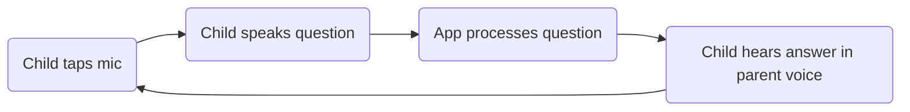

# AI Nanny — Product Requirements Document

**Created**: April 2026
**Status**: Closed

---

## 1. Value Proposition

A child speaks a question into a web app, and within seconds hears a warm, age-appropriate answer spoken back in their parent's own cloned voice. This replaces generic voice assistants with a trusted, familiar voice and child-safe content.

**Why this matters now:** ElevenLabs Instant Voice Clone makes high-quality voice cloning accessible with minimal audio input. Groq's free LLM inference makes real-time conversational AI viable at zero cost. Together, they enable a product that wasn't economically feasible 12 months ago.

---

## 2. User Journey

Maya is 6 years old and wants to know why the moon changes shape. Her dad is busy making dinner. She taps the big microphone button on the tablet, asks her question, and a few seconds later hears her dad's voice explain that the moon is like a ball that gets lit up by the sun from different sides. She giggles, says "cool!", and asks another question.



| Phase | User Intent | Emotional State | User Action |
|-------|-------------|-----------------|-------------|
| **Record** | Ask a question | Curious, excited | Tap and hold mic button, speak |
| **Wait** | Get an answer | Anticipating | See "thinking" animation |
| **Listen** | Hear the answer | Delighted, learning | Listen to parent-voice response |
| **Continue** | Ask follow-up | Engaged | Tap mic again |

---

## 3. User Stories

### Phase 1: Voice Setup (Parent)

| ID | Story |
|----|-------|
| US-1 | As a parent, I can clone my voice via ElevenLabs dashboard so my child hears answers in my voice |
| US-2 | As a parent, I can configure the voice_id in the app so the backend uses my cloned voice for TTS |

### Phase 2: Child Q&A Loop

| ID | Story |
|----|-------|
| US-3 | As a child, I can tap a mic button and speak my question so the app can hear me |
| US-4 | As a child, I can see a visual indicator while the app is thinking so I know to wait |
| US-5 | As a child, I can hear an answer spoken in my parent's voice so it feels familiar and safe |
| US-6 | As a child, I can ask follow-up questions and get answers that understand context from my previous questions |

### Phase 3: Safety & Search

| ID | Story |
|----|-------|
| US-7 | As a child, I always receive age-appropriate answers because the LLM has safety guardrails in its system prompt |
| US-8 | As a child, I get accurate answers to factual questions because the backend enriches the LLM with web search results |

---

## 4. System Overview

```
Browser (Lovable frontend)
  ↓ audio blob via POST /api/ask
Next.js API Route (Vercel)
  ↓ audio file
ElevenLabs Scribe (STT)
  ↓ transcribed text
Exa Search API (web search)
  ↓ search context
Groq / Llama 3.3 70B (LLM)
  ↓ child-friendly answer text
ElevenLabs TTS (Flash v2.5 + cloned voice)
  ↓ audio/mpeg
Browser (plays audio)
```

---

## 5. Data Sources & APIs

| API | Provides | Free Tier | Concern |
|-----|----------|-----------|---------|
| ElevenLabs Scribe | Speech-to-text | 10K chars/month | May hit limit with extended testing |
| ElevenLabs TTS | Text-to-speech in cloned voice | 10K chars/month | Same pool as STT |
| ElevenLabs Voice Clone | Instant voice cloning | Included | Quality depends on recording quality |
| Groq | LLM inference (Llama 3.3 70B) | Free, rate-limited | 30 req/min on free tier |
| Exa Search | Semantic web search | 1000 searches/month | More than enough for hackathon |

---

## 6. Risks

| Risk | Impact |
|------|--------|
| ElevenLabs free tier character limit exhausted during demo | TTS/STT stops working; need paid plan or new account |
| Groq rate limit hit (30 req/min) | Answers delayed or dropped; unlikely for single-user demo |
| LLM generates inappropriate content despite system prompt | Child hears unsafe content; mitigated by strong system prompt but not 100% |
| Browser mic permissions denied | App can't record; need clear UI prompt explaining why mic is needed |
| High latency (>6s) frustrates child | Child loses interest; mitigated by Groq speed and ElevenLabs Flash model |
| webm audio format not supported by ElevenLabs STT | Transcription fails; needs format testing |
