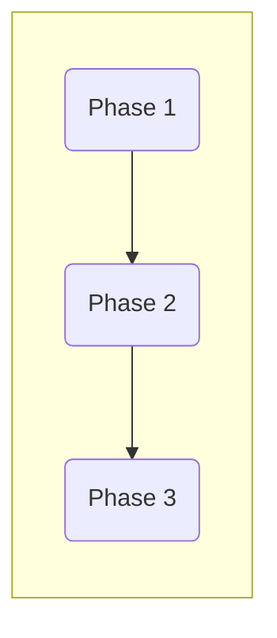

# [Project Name] — Product Requirements Document

**Created**: [Month Year]
**Status**: In Progress

---

## 1. Value Proposition

<!--
One paragraph that explains what this product does and why it matters. Not features — the transformation. What painful workflow does this replace, and what does the user get instead?

If there's a "why now" angle (new technology, market shift, regulatory change), call it out. This helps readers understand why the opportunity exists today and didn't before.
-->

[What does this product do for the user in one paragraph? Focus on the before/after — what changes in their life.]

**Why this matters now:** [What makes this feasible or timely today that wasn't true before?]

---

## 2. User Journey

<!--
Start with a contextual narrative: a short scenario (3-4 sentences) that puts a named persona in a real situation using the product. This grounds the entire journey in a lived moment rather than an abstract flow.

Then include a diagram showing the phases of the journey — the high-level flow the user moves through.

Then fill in the journey table. This table should be broad and light — it explains each phase at a glance. Detailed requirements belong in the User Stories section, not here.

Guidelines for the table:
- User Intent: What is the user trying to accomplish in this phase? Write it in first person ("Find something to do tonight").
- Emotional State: How does the user feel? This helps prioritize where to invest design effort. Anxiety, confusion, and impatience need more care than neutral states.
- User Action: What does the user literally do? Keep it concrete but not granular — actions, not clicks.

If your product has "always accessible" features (settings, history, help), include them as rows at the bottom of the table.
-->

[Contextual narrative: 3-4 sentences. Named persona, real situation, specific moment. Show the product solving the problem in one continuous flow.]

| Phase         | User Intent                     | Emotional State | User Action    |
| ------------- | ------------------------------- | --------------- | -------------- |
| **[Phase 1]** | [What the user is trying to do] | [How they feel] | [What they do] |
| **[Phase 2]** | [What the user is trying to do] | [How they feel] | [What they do] |
| **[Phase 3]** | [What the user is trying to do] | [How they feel] | [What they do] |

---

## 3. User Stories

<!--
Organize stories by journey phase. Each phase gets its own subsection and table.

Story format: "As a [user type], I can [action] so [outcome/reason]."

Tips:
- Stories should be testable — an engineer should know what to build and QA should know what to verify.
- Include edge cases and error states where they matter (e.g., "if no results match" or "if the connection fails").
- One story per discrete capability. Don't bundle multiple features into a single story.
- Number stories sequentially across all phases (US-1, US-2, ...) so they can be referenced in iteration plans and backlogs.
-->

### Phase 1: [Phase Name]

| ID | Story |
|----|-------|
| US-1 | As a [user type], I can [action] so [outcome] |
| US-2 | As a [user type], I can [action] so [outcome] |

### Phase 2: [Phase Name]

| ID | Story |
|----|-------|
| US-3 | As a [user type], I can [action] so [outcome] |

---

## 4. System Overview

<!--
High-level architecture. How does the system work? What are the major components and how do they interact? This doesn't need to be a full technical spec — just enough for someone to understand the shape of the system.

Include a diagram if it helps. For agent-based or API-heavy products, show what calls what.
-->

---

## 5. Data Sources & APIs

<!--
What external systems, APIs, or data sources does this product depend on? For each, note:
- What it provides
- Free tier limits or cost implications
- Reliability concerns

This section is critical for products that orchestrate multiple external services. If your product is self-contained with no external dependencies, you can leave this section blank.
-->

---

## 6. Risks

<!--
What could go wrong? Be honest. Each risk should have a clear impact statement so the team can prioritize mitigation.

Good risks are specific and actionable. "It might not work" is not a risk. "The Yelp API rate-limits at 500 calls/day, which caps us at ~50 plans/day" is a risk.

Consider:
- Technical risks (API limits, data quality, latency, fragile dependencies)
- Product risks (core assumption might be wrong, user might not trust AI output)
- Operational risks (OAuth complexity, scraper maintenance, cost at scale)
-->

| Risk | Impact |
|------|--------|
| [Specific technical, product, or operational risk] | [What happens if this risk materializes] |
| [Specific technical, product, or operational risk] | [What happens if this risk materializes] |
